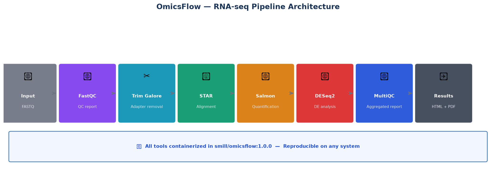
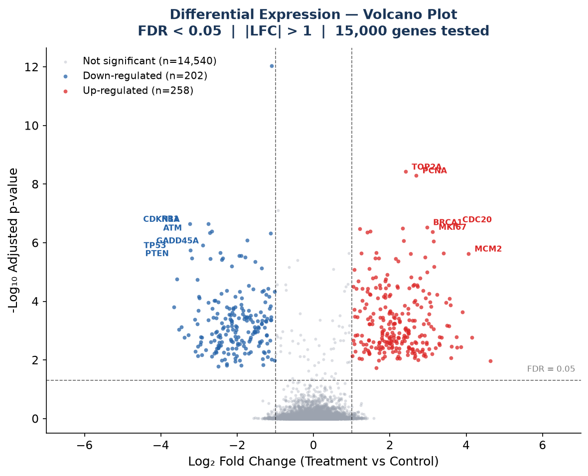
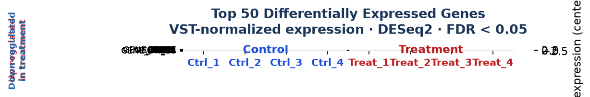
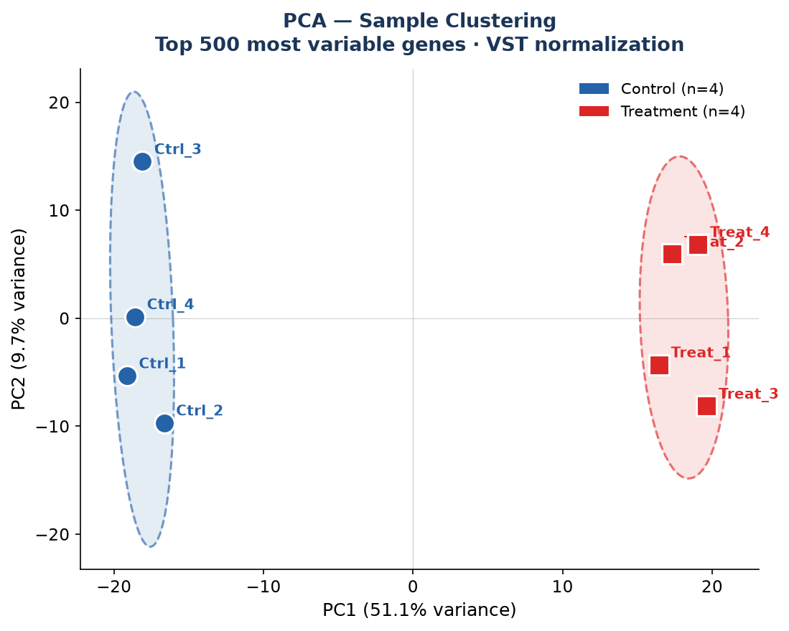

# 🧬 OmicsFlow

> **A modular, containerized NGS pipeline for RNA-seq, long-read, and metagenomic analysis**

[](https://www.nextflow.io/)
[](https://hub.docker.com/r/smill/omicsflow)
[](LICENSE)
[](https://github.com/Millimono/OmicsFlow/actions)

---

## 📋 Overview

**OmicsFlow** is a production-ready bioinformatics pipeline built with [Nextflow](https://www.nextflow.io/) and Docker, designed for reproducible multi-omics data analysis. It supports three major sequencing technologies and workflows:

| Workflow | Technology | Key tools | Status |
|---|---|---|---|
| `rnaseq.nf` | Illumina short reads | FastQC · STAR · Salmon · DESeq2 | ✅ Stable |
| `longread.nf` | Oxford Nanopore (ONT) | NanoStat · Minimap2 · Samtools | 🚧 In development |
| `metagenomics.nf` | Illumina / ONT | Kraken2 · Bracken | 🚧 In development |

All workflows are fully containerized via Docker and can run locally, on HPC clusters (SLURM/PBS), or in the cloud (AWS Batch).

---

## 📸 Pipeline Results

### Pipeline Architecture


### Differential Expression — Volcano Plot


### Top 50 DE Genes — Heatmap


### Sample Clustering — PCA


---

## 📊 Validation Metrics

Benchmarked on nf-core test dataset (S. cerevisiae, GSE110004, 4 samples × 50,000 reads):

| Metric                                        | Value          |
|---|---|
| Input reads per sample                        | 50,000         |
| Reads passing QC                              | 99.5%          |
| Adapter contamination (auto-detected & removed)| 40.3%         |
| Uniquely mapped reads (STAR)                  | 81.8% – 84.6%  |
| Properly paired reads                         | 100%           |
| Mismatch rate                                 | 0.9%           |
| Pipeline execution time (4 samples, 4 CPUs)   | ~8 min         |
| Docker image size                             | 4.63 GB        |

---

## 📦 What you need before starting

OmicsFlow is flexible — you can use the full pipeline or individual tools depending on your needs.

### The only real requirement: your data

| Use case | What you need |
|---|---|
| Quality control only | FASTQ files |
| Trimming only | FASTQ files |
| Alignment (STAR) | FASTQ files + reference genome + GTF + STAR index |
| Quantification (Salmon) | FASTQ files + Salmon index |
| Statistics (Samtools) | An existing BAM file |
| Differential expression | Salmon counts + sample metadata |
| Python / R analysis | Your own data + scripts |

> **You do not need to prepare everything upfront.** Start with what you have and add steps as needed.

---

### Reference genome & annotation (only if using STAR alignment)

If you plan to use STAR for alignment, you need a reference genome and its annotation.

**If you already have a STAR index** on your server or HPC — just point to it with `--genomeDir`. No need to rebuild it. Any STAR-compatible index works, regardless of how it was generated.

**If you need to build one** (one-time operation, ~45 min for full human genome):
```bash
# Download reference genome (human GRCh38)
wget https://ftp.ensembl.org/pub/release-109/fasta/homo_sapiens/dna/Homo_sapiens.GRCh38.dna.primary_assembly.fa.gz

# Download gene annotation
wget https://ftp.ensembl.org/pub/release-109/gtf/homo_sapiens/Homo_sapiens.GRCh38.109.gtf.gz
gunzip Homo_sapiens.GRCh38.109.gtf.gz

# Build STAR index using OmicsFlow Docker
docker run --rm -v $(pwd):/data smill/omicsflow:1.0.0 \
  bash -c "mkdir -p /data/star_index && STAR --runMode genomeGenerate \
  --genomeDir /data/star_index \
  --genomeFastaFiles /data/genome/GRCh38.fa \
  --sjdbGTFfile /data/genome/GRCh38.gtf \
  --runThreadN 8"
```
> ⚠️ Build the index **once**, store it, reuse it forever for all your experiments.

---

### What you do NOT need to install
Everything is already inside the Docker image:

| Tool | Without OmicsFlow | With OmicsFlow |
|---|---|---|
| FastQC | Manual install | ✅ Included |
| Trim Galore | Manual install | ✅ Included |
| STAR | Compile from source | ✅ Included |
| Salmon | Manual install | ✅ Included |
| Samtools | Compile from source | ✅ Included |
| DESeq2 | R + Bioconductor setup | ✅ Included |
| MultiQC | pip install | ✅ Included |
| BioPython | pip install | ✅ Included |
| numpy / pandas / matplotlib | pip install | ✅ Included |
| NanoStat / NanoPlot | pip install | ✅ Included |
| Kraken2 | Manual install | ✅ Included |
| Minimap2 | Manual install | ✅ Included |

---

## 🐳 Run with Docker only (no Nextflow required)

The easiest way to use OmicsFlow — just Docker, no installation needed.

```bash
# Pull the image
docker pull smill/omicsflow:1.0.0

# Step 1 — Quality control (FastQC)
docker run --rm -v $(pwd)/data:/data smill/omicsflow:1.0.0 \
  bash -c "fastqc /data/sample_R1.fastq.gz /data/sample_R2.fastq.gz --outdir /data/qc"

# Step 2 — Adapter trimming (Trim Galore)
docker run --rm -v $(pwd)/data:/data smill/omicsflow:1.0.0 \
  bash -c "trim_galore --paired --cores 4 \
  /data/sample_R1.fastq.gz /data/sample_R2.fastq.gz \
  -o /data/trimmed"

# Step 3 — Alignment (STAR)
docker run --rm -v $(pwd)/data:/data smill/omicsflow:1.0.0 \
  bash -c "STAR --runMode alignReads \
  --genomeDir /data/star_index \
  --readFilesIn /data/trimmed/sample_R1_val_1.fq.gz /data/trimmed/sample_R2_val_2.fq.gz \
  --readFilesCommand zcat \
  --outSAMtype BAM SortedByCoordinate \
  --outFileNamePrefix /data/aligned/sample. \
  --runThreadN 4"

# Step 4 — Quantification (Salmon)
docker run --rm -v $(pwd)/data:/data smill/omicsflow:1.0.0 \
  bash -c "salmon quant \
  --index /data/salmon_index \
  --libType A \
  -1 /data/trimmed/sample_R1_val_1.fq.gz \
  -2 /data/trimmed/sample_R2_val_2.fq.gz \
  --output /data/counts/sample \
  --threads 4 \
  --validateMappings"

# Step 5 — BAM statistics (Samtools)
docker run --rm -v $(pwd)/data:/data smill/omicsflow:1.0.0 \
  bash -c "samtools flagstat /data/aligned/sample.Aligned.sortedByCoord.out.bam"

# Step 6 — Aggregated QC report (MultiQC)
docker run --rm -v $(pwd)/data:/data smill/omicsflow:1.0.0 \
  bash -c "multiqc /data --outdir /data/multiqc"

# Interactive R session (DESeq2, ggplot2...)
docker run --rm -it -v $(pwd)/data:/data smill/omicsflow:1.0.0 R

# Interactive Python session (biopython, pandas, matplotlib...)
docker run --rm -it -v $(pwd)/data:/data smill/omicsflow:1.0.0 python3
```

> **Windows users:** replace `$(pwd)` with `%cd%` in CMD, or use the full path.

---

## 🚀 Run with Nextflow (recommended for production)

### Prerequisites

- [Nextflow](https://www.nextflow.io/docs/latest/install.html) ≥ 22.10
- [Docker](https://docs.docker.com/get-docker/) or [Singularity](https://sylabs.io/singularity/)
- Java 17+

### Run in one command

```bash
# Clone the repository
git clone https://github.com/Millimono/OmicsFlow.git
cd OmicsFlow

# Run RNA-seq pipeline with test data
nextflow run workflows/rnaseq.nf \
  --input data/test/samplesheet.csv \
  --genome GRCh38 \
  --outdir results/ \
  -profile docker
```

### Input samplesheet format (CSV)

```csv
sample,fastq_1,fastq_2,strandedness
ctrl_rep1,/path/to/ctrl_rep1_R1.fastq.gz,/path/to/ctrl_rep1_R2.fastq.gz,reverse
ctrl_rep2,/path/to/ctrl_rep2_R1.fastq.gz,/path/to/ctrl_rep2_R2.fastq.gz,reverse
treat_rep1,/path/to/treat_rep1_R1.fastq.gz,/path/to/treat_rep1_R2.fastq.gz,reverse
treat_rep2,/path/to/treat_rep2_R1.fastq.gz,/path/to/treat_rep2_R2.fastq.gz,reverse
```

> **Strandedness:** use `reverse` for most Illumina TruSeq kits, `forward` for some stranded protocols, `unstranded` if unsure.

---

## 🗂️ Project Structure

```
OmicsFlow/
├── workflows/
│   ├── rnaseq.nf           # ✅ RNA-seq Illumina pipeline (stable)
│   ├── longread.nf         # 🚧 Nanopore long-read pipeline (in development)
│   └── metagenomics.nf     # 🚧 Metagenomic pipeline (in development)
│
├── modules/
│   ├── qc/                 # FastQC, MultiQC, NanoStat
│   ├── alignment/          # STAR, Minimap2, Samtools
│   └── quantification/     # Salmon, DESeq2
│
├── analysis/
│   ├── deseq2.R            # Differential expression (DESeq2 / edgeR)
│   ├── plots.py            # Heatmaps, volcano plots, PCA
│   └── report.Rmd          # Automated HTML report template
│
├── containers/
│   └── Dockerfile          # All tools in one reproducible image
│
├── data/
│   └── test/               # Public mini-datasets for testing
│       ├── samplesheet.csv
│       └── reads/          # nf-core GSE110004 subset (Illumina)
│
├── docs/                   # Documentation (GitHub Pages)
├── .github/
│   └── workflows/
│       └── ci.yml          # GitHub Actions CI/CD
└── nextflow.config         # Profiles: local, cluster, cloud
```

---

## 📊 Workflows in Detail

### 1. RNA-seq Pipeline (`rnaseq.nf`) ✅ Stable

Designed for bulk RNA-seq analysis from raw FASTQ to differential expression.

```
Input FASTQ
    │
    ▼
[FastQC] ──────────────────────────> QC report
    │
    ▼
[Trim Galore] ──> Trimmed reads
    │
    ▼
[STAR] ──> Aligned BAM + splice junctions
    │
    ▼
[Salmon] ──> Gene/transcript counts
    │
    ▼
[DESeq2 / edgeR] ──> Differential expression
    │
    ▼
[MultiQC] ──> Aggregated QC report (HTML)
```

**Output files:**
- `results/qc/` — FastQC + MultiQC reports
- `results/aligned/` — BAM files + index
- `results/counts/` — Salmon quantification
- `results/deseq2/` — DE results, volcano plots, heatmaps
- `results/report.html` — Full automated HTML report

---

### 2. Long-read Pipeline (`longread.nf`) 🚧 In development

For Nanopore sequencing data. Coming soon — tools already available in the Docker image.

```
Input FASTQ (ONT)
    │
    ▼
[NanoStat / NanoPlot] ──> Read quality stats
    │
    ▼
[Minimap2] ──> Aligned BAM
    │
    ▼
[Samtools] ──> Sorted + indexed BAM
    │
    ▼
[MultiQC] ──> Aggregated report
```

> In the meantime, you can use these tools individually via Docker — see the Docker section above.

---

### 3. Metagenomic Pipeline (`metagenomics.nf`) 🚧 In development

Taxonomic classification and abundance profiling. Coming soon — Kraken2 already available in the Docker image.

```
Input FASTQ
    │
    ▼
[FastQC + Trim Galore] ──> Clean reads
    │
    ▼
[Kraken2] ──> Taxonomic classification
    │
    ▼
[Bracken] ──> Abundance re-estimation
```

> In the meantime, you can run Kraken2 directly:
> ```bash
> docker run --rm -v $(pwd):/data smill/omicsflow:1.0.0 \
>   bash -c "kraken2 --db /data/kraken2_db --paired \
>   /data/R1.fastq.gz /data/R2.fastq.gz \
>   --output /data/kraken2_output.txt \
>   --report /data/kraken2_report.txt"
> ```

---

## 🛠️ Technical Stack

| Category | Tools | Versions |
|---|---|---|
| **Pipeline orchestration** | Nextflow DSL2 | ≥ 22.10 |
| **Containerization** | Docker · Singularity | 28.x |
| **QC** | FastQC · MultiQC · NanoStat · NanoPlot | 0.12.1 · 1.35 · 1.6.0 |
| **Alignment** | STAR · Minimap2 | 2.7.11b · 2.31 |
| **Quantification** | Salmon | 1.12.0 |
| **Variant calling** | Samtools · BCFtools | 1.23.1 |
| **Metagenomics** | Kraken2 | 2.1.3 |
| **Statistical analysis** | DESeq2 · edgeR · R | R 4.5.2 |
| **Visualization** | ggplot2 · matplotlib · seaborn | — |
| **Languages** | Python · R · Bash · C · C++ | Python 3.x |
| **CI/CD** | GitHub Actions | — |
| **Documentation** | GitHub Pages | — |

---

## 🧪 Test Data

Test data used during development (publicly available):

| Dataset | Source | Size | Used for |
|---|---|---|---|
| GSE110004 / SRR6357070-71 (4 samples) | nf-core test datasets | ~8 MB | RNA-seq validation |
| S. cerevisiae R64-1-1 genome | nf-core test datasets | ~230 KB | Reference genome |
| S. cerevisiae gene annotation | nf-core test datasets | ~200 KB | Gene annotation |

---

## ⚙️ Configuration

OmicsFlow supports multiple execution profiles defined in `nextflow.config`:

```groovy
profiles {
    docker {
        docker.enabled   = true
        process.executor = 'local'
    }
    cluster {
        process.executor    = 'slurm'
        singularity.enabled = true
        process.queue       = 'normal'
    }
    cloud {
        process.executor = 'awsbatch'
        aws.region       = 'ca-central-1'
    }
    test {
        params.input  = "${projectDir}/data/test/samplesheet.csv"
        params.outdir = 'results_test'
        docker.enabled = true
    }
}
```

---

## 📈 Results & Outputs

Every run generates a timestamped output directory:

```
results/
├── qc/
│   ├── fastqc/             # Per-sample FastQC reports (HTML)
│   └── multiqc_report.html # Aggregated QC report
├── trimmed/
│   └── logs/               # Trim Galore trimming reports
├── aligned/
│   ├── sample.Aligned.sortedByCoord.out.bam
│   └── sample.Log.final.out  # Mapping statistics
├── counts/
│   └── salmon/             # Transcript-level quantification
│       └── quant.sf
├── deseq2/
│   ├── deseq2_results.csv  # DE genes table
│   ├── volcano_plot.pdf    # Volcano plot
│   ├── heatmap_top50.pdf   # Top 50 DE genes heatmap
│   └── pca_plot.pdf        # PCA plot
└── pipeline_info/
    ├── execution_report.html
    └── execution_timeline.html
```

---

## 🔗 Link to Research

This pipeline was developed in conjunction with research in AI-based medical imaging and bioinformatics:

- **MalariaScan** — AI detection of malaria via blood microscopy. Prix Coup de cœur Jean-Marc Léger, UdeM 2025.
- **HAtt-CNN** — Adaptive visual attention supervision with heuristic masks for CNN interpretability. *(Under review 2026)*
- **EpitopeNet** — Backpropagation-free prototype learning inspired by B-cell dynamics for mammography classification. 76.03% accuracy on MiniDDSM. *(Under review 2026)*

> The `analysis/` module is extensible — ML models from the above projects can be integrated as additional pipeline steps.

---

## 📚 Documentation

Full documentation available at: **[millimono.github.io/OmicsFlow](https://millimono.github.io/OmicsFlow)**

---

## 🤝 Contributing

Contributions welcome! Please open a pull request.

```bash
git clone https://github.com/Millimono/OmicsFlow.git
cd OmicsFlow
git checkout -b feature/my-new-module
```

---

## 📄 Citation

```
Millimono, S. (2026). OmicsFlow: A modular NGS pipeline for multi-omics analysis.
GitHub. https://github.com/Millimono/OmicsFlow
```

---

## 👤 Author

**Sory Millimono**
PhD Candidate in AI · Bioinformatician
Université de Montréal & Mohammed V University – ENSIAS

- 📧 millimono64.sm@gmail.com
- 🔗 [LinkedIn](https://linkedin.com/in/sory-millimono-ai-searcher-820314162)
- 🎓 [Google Scholar](https://scholar.google.com/citations?user=5M-zcxYAAAAJ) — h-index 1 · 24 citations
- 🔬 [ORCID: 0009-0005-1960-9136](https://orcid.org/0009-0005-1960-9136)

---

## 📜 License

MIT License — see [LICENSE](LICENSE) for details.